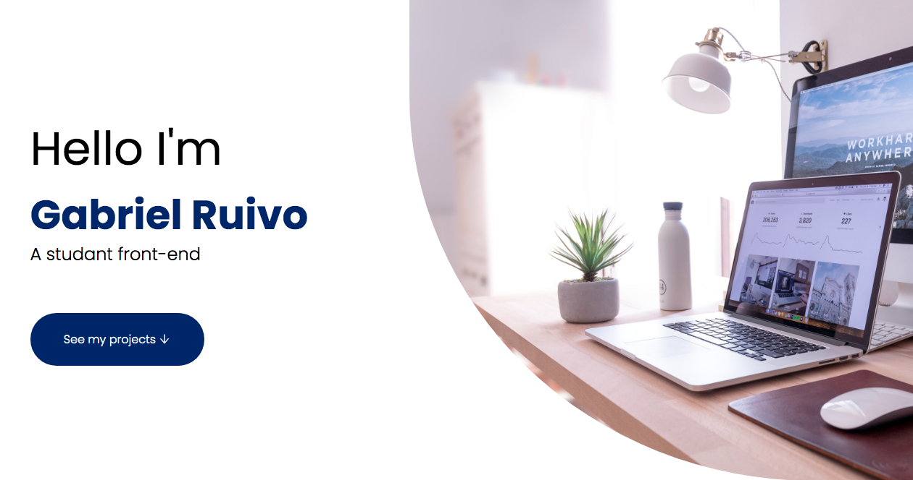
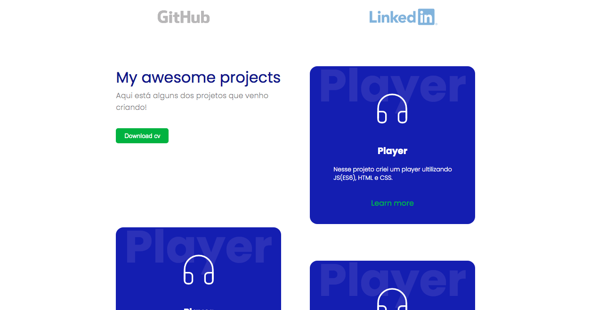

# Personal website

Você pode ver minha aplicação funcionando nesse link: <a href="https://unruffled-goldberg-142621.netlify.app/" target="_blank" >Aqui</a>
 

  
  

## Available Scripts
In the project directory, you can run:

### `yarn start`

Runs the app in the development mode. 
Open [http://localhost:3000](http://localhost:3000) to view it in the browser.

The page will reload if you make edits. 
You will also see any lint errors in the console.

## 🤓 Technologies 

Este projeto esta sendo desenvolvido usando:

- ✅ REACTJS (REACT HOOK)

